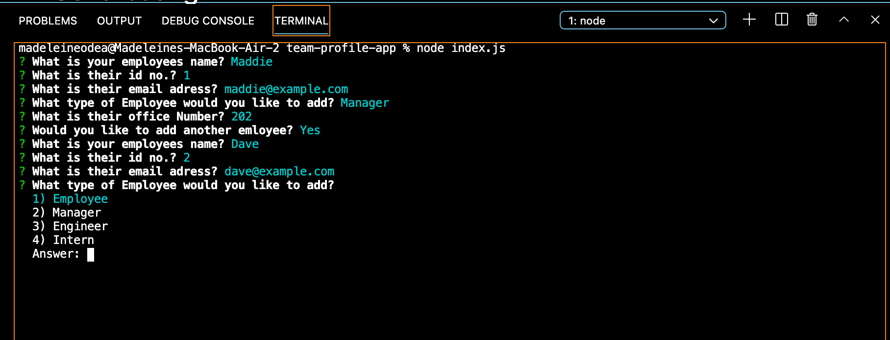
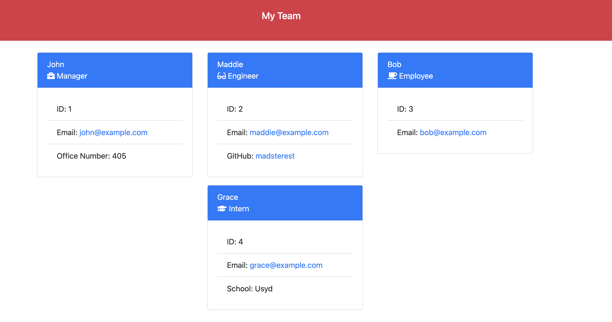

# team-profile-generator

 # Description
 
 This application allows the user to generate a clean and professional website displaying helpful information about their teams employees.
 This process takes the hassel out of creating a polished website and can be customised depending on the needs of the team. The website also has clickable links to the teams email, so the users preffered mail service will open allowing for easy communication with the team memebers.
 This program is created dynamically so it can easily adjust to any number of team members or roles. The rendered page is polished and clean as well as being responsive.

 # Table of Contents
 
 * [Installation](#installation)
 * [Useage](#useage)
 * [Contributing](#contributing)
 * [Tests](#tests)
 * [License](#license)
 * [Questions](#questions)

 # Installation
 This require Node.js and Inquirer.js to run.

 # Useage
 The user will be asked a series of questions regarding their team members including Name, Id number, email, office number, github username, school and the employees Role. An html file will then be created conatining the users inputs.
 
 Click the link below for a Demo of the application:
 https://drive.google.com/file/d/1cG6CwTDfRJIkhEPeo3Y3hQoJR6XaVXRj/view
 
 
 
 
 
 
 

 # Contributing
 This app was created by Madeleine O'Dea.
 

 # Tests
 The program was tested using Jest. This would be need to be downloaded by the user and npm test written in the terminal.
 

 # License
  Licensed under MIT.
  For more information, visit this link.
  https://opensource.org/licenses/MIT
  
  
# Questions
For more examples of my work, please visit my GitHub at [madsterest](https://github.com/madsterest)
or contact me at
odea.madeleine@gmail.com
